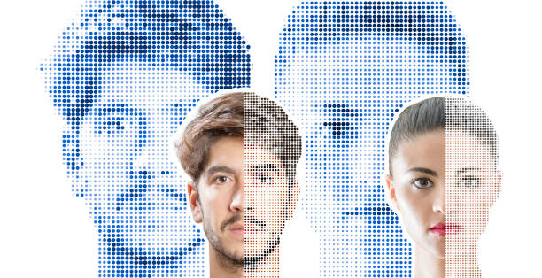

## Packages for Face Recognition will be Used:

Python provides several powerful packages that facilitate face recognition. Some of the most popular ones we will be using.

1. **OpenCV:** OpenCV is a versatile computer vision library that offers various face detection and recognition algorithms, such as Haar cascades and deep learning-based models.

2. **Face_recognition:** This Python library is built on top of dlib and provides a simple API for face recognition tasks. It offers both face detection and recognition functionalities. I will be using Ageitgey's API for Python [Github](https://github.com/ageitgey/face_recognition)

3. **Regular Expressions:** With regex, you can define complex search patterns to match and extract specific parts of strings, validate input, or replace text based on certain criteria.

4. **NumPy:** NumPy, short for Numerical Python, is a fundamental package in Python for scientific computing. It provides support for large, multi-dimensional arrays and matrices, along with a collection of mathematical functions to operate on these arrays efficiently.

### Let me give you an overview of the steps included in face recognition.

1. **Face Detection:** The first step is to detect faces within an image or video frame. This can be done using algorithms like Haar cascades, HOG (Histogram of Oriented Gradients), etc.

2. **Face Alignment:** Face alignment techniques aim to normalize the face's orientation, scale, and pose to improve consistency.

3. **Face Encoding:** After alignment, facial features need to be transformed into a numerical representation that can be used for recognition. This process is called face encoding or face embedding. Deep learning models, such as convolutional neural networks (CNNs), are commonly used to extract high-dimensional feature vectors that capture the unique characteristics of each face.

4. **Face Matching:** To differentiate between two faces, a distance or similarity metric is used to compare the face encodings generated in the previous step. Popular metrics include Euclidean distance or cosine similarity.

****

## Some Features of this Project

1. **Displays Name and Class:** After recognizing the face embeddings or facial features, it displays the name and class of the detected individual.

2. **Marks Attendance after Fixed Frame Capture:** The attendance will be marked after satisfying the condition of frames captured (greater than or equal to 7) to avoid false positives or misidentification.

3. **One Attendance at a time:** A Boolean variable will be used to avoid "duplicate attendance" or "double counting."

4. **Separate Attendance Database:** A separate database(CSV file) will be made for Teacher Attendance and Student Attendance based on the faces recognized.

5. **'Attendance Marked' Notify:** 'Attendance Marked' will be written on the window if the individual's attendance is already marked after checking into the database(CSV file).

6. **Saving Attendance:** Attendance will be saved into a database(CSV file) with the Name, Class, and Date and Time of the attendance.